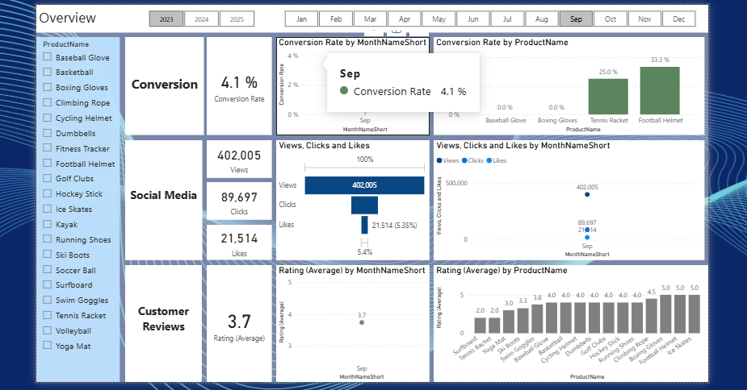
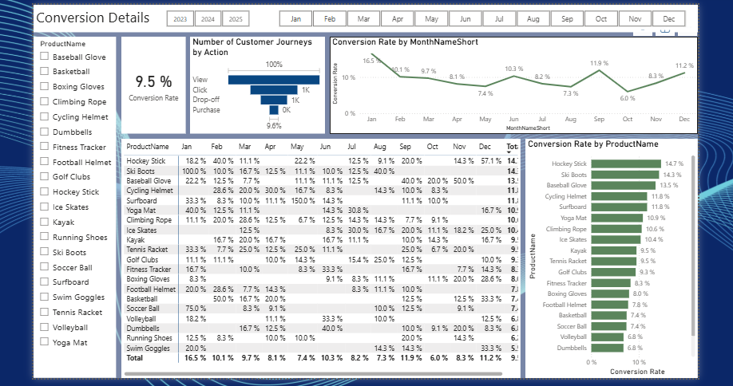
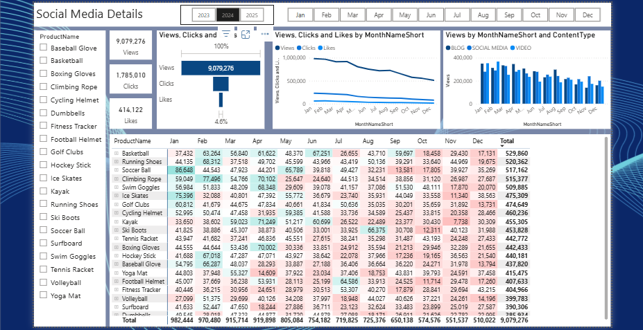

<h1>📊 Pro Sport Co. — Marketing Analytics Dashboard</h1>
<h3>Interactive Power BI Portfolio Project | E-commerce Sports Brand</h3>
<blockquote>

<strong>A comprehensive 4-page interactive Power BI dashboard analyzing marketing performance across Conversion, Social Media, and Customer Reviews — built for Pro Sport Co., a fictional e-commerce sports equipment brand with 20 products and $9M+ in annual marketing reach.</strong>

</blockquote>

 
 
 

<h2>📋 Table of Contents</h2>
<ol>
<li><a href="#-project-overview">Project Overview</a></li>
<li><a href="#-company-context">Company Context</a></li>
<li><a href="#-repository-structure">Repository Structure</a></li>
<li><a href="#-quick-access-links">Quick Access Links</a></li>
<li><a href="#-dashboard-pages">Dashboard Pages</a></li>
<li><a href="#-key-business-insights">Key Business Insights</a></li>
<li><a href="#-business-problems-solved">Business Problems Solved</a></li>
<li><a href="#-tools--techniques">Tools &amp; Techniques</a></li>
<li><a href="#-skills-demonstrated">Skills Demonstrated</a></li>
<li><a href="#-how-to-explore-this-project">How To Explore</a></li>
<li><a href="#-about-the-author">About The Author</a></li>
</ol>

<h2>🎯 Project Overview</h2>

This portfolio project delivers a <strong>fully interactive Power BI marketing analytics dashboard</strong> for <strong>Pro Sport Co.</strong>, tracking marketing performance across three strategic pillars:

<table><thead><tr><th>Pillar</th><th>Focus</th><th>Key Metrics</th></tr></thead><tbody><tr><td>🛒 <strong>Conversion</strong></td><td>Funnel performance</td><td>9.5% annual conversion rate</td></tr><tr><td>📱 <strong>Social Media</strong></td><td>Engagement &amp; reach</td><td>9M+ views, 4.6% engagement</td></tr><tr><td>⭐ <strong>Customer Reviews</strong></td><td>Sentiment &amp; satisfaction</td><td>3.7/5 rating, 141 reviews</td></tr></tbody></table>

<strong>Data Period:</strong> 2023–2025 
<strong>Product Coverage:</strong> 20 sports products 
<strong>Interactivity:</strong> Month-level + Product-level filtering across all pages

<h2>🏢 Company Context</h2>

<strong>Pro Sport Co.</strong> is a fictional sports equipment e-commerce brand created for portfolio purposes. The company sells 20 sports products including:

<pre><code>🏀 Basketball         👟 Running Shoes      🏒 Hockey Stick
⚽ Soccer Ball        ⛳ Golf Clubs         🧘 Yoga Mat
🏄 Surfboard          🎿 Ski Boots          ⚾ Baseball Glove
🥽 Swim Goggles       ... and 10 more products
</code></pre>

<strong>Business Context:</strong> 
A digital-first sports retailer using marketing analytics to optimize budget allocation, identify high-performing products, understand seasonal demand patterns, and improve customer experience based on sentiment data.

<h2>📁 Repository Structure</h2>
<pre><code>prosport-marketing-analytics/
│
├── 📄 README.md                              ← You are here
│
├── 📁 01_PowerBI_File/                       
│   └── ProSport_Marketing_Analytics.pbix     (Source Power BI file)
│
├── 📁 02_PDF_Export/                         
│   └── ProSport_Dashboard_Full_Export.pdf    (Full dashboard PDF)
│
└── 📁 03_Dashboard_Screenshots/              
    ├── page1_overview.png                    (Executive overview)
    ├── page2_conversion.png                  (Conversion deep-dive)
    ├── page3_social_media.png                (Social media analytics)
    └── page4_customer_reviews.png            (Reviews &amp; sentiment)
</code></pre>

<h2>🔗 Quick Access Links</h2>

<table><thead><tr><th>Resource</th><th>Description</th><th>Link</th></tr></thead><tbody><tr><td>📊 <strong>Power BI File</strong></td><td>Source <code>.pbix</code> file (download to view live)</td><td><a href="./01_PowerBI_File/">Download</a></td></tr><tr><td>📄 <strong>PDF Export</strong></td><td>Static full dashboard export</td><td><a href="./02_PDF_Export/">Download</a></td></tr><tr><td>🖼️ <strong>Screenshots</strong></td><td>All 4 dashboard pages as images</td><td><a href="./03_Dashboard_Screenshots/">View</a></td></tr></tbody></table>

<blockquote>

💡 <strong>To explore the live interactive dashboard:</strong> Download the <code>.pbix</code> file from the <a href="./01_PowerBI_File/">01_PowerBI_File folder</a> and open it in <a href="https://powerbi.microsoft.com/desktop/">Power BI Desktop</a> (free). Screenshots below provide instant preview.

</blockquote>

<h2>📊 Dashboard Pages</h2>
<h3>Page 1 — Executive Overview</h3>

<strong>High-level marketing KPI summary across all three pillars</strong>

<strong>Visuals Included:</strong>

<ul>
<li>🎯 Overall conversion rate KPI card</li>
<li>👀 Total social media views KPI</li>
<li>🖱️ Total clicks KPI</li>
<li>❤️ Total likes KPI</li>
<li>⭐ Average customer rating KPI</li>
<li>📅 Year/month slicers</li>
<li>🛍️ Product filter panel</li>
</ul>

<strong>Purpose:</strong> Single-glance health check for marketing leadership

<h3>Page 2 — Conversion Details</h3>

<strong>Deep-dive into Pro Sport Co.'s funnel performance</strong>

<strong>Key Metrics:</strong>

<table><thead><tr><th>Metric</th><th>Value</th></tr></thead><tbody><tr><td>Annual Conversion Rate</td><td><strong>9.5%</strong></td></tr><tr><td>Peak Month</td><td>January (<strong>16.5%</strong>)</td></tr><tr><td>Lowest Month</td><td>October (<strong>6.0%</strong>)</td></tr><tr><td>Funnel View → Purchase</td><td><strong>9.6%</strong></td></tr></tbody></table>

<strong>Top Converting Products:</strong>

<table><thead><tr><th>Rank</th><th>Product</th><th>Conversion Rate</th></tr></thead><tbody><tr><td>🥇</td><td>Hockey Stick</td><td>14.7%</td></tr><tr><td>🥈</td><td>Ski Boots</td><td>14.3%</td></tr><tr><td>🥉</td><td>Baseball Glove</td><td>13.5%</td></tr></tbody></table>

<strong>Bottom Performing Products:</strong>

<table><thead><tr><th>Rank</th><th>Product</th><th>Conversion Rate</th></tr></thead><tbody><tr><td>🔻</td><td>Swim Goggles</td><td>5.5%</td></tr><tr><td>🔻</td><td>Running Shoes</td><td>6.2%</td></tr></tbody></table>

<strong>Visuals Included:</strong>

<ul>
<li>📈 Monthly conversion trend line</li>
<li>📊 Product-by-product conversion table (month breakdown)</li>
<li>📉 Ranked bar chart of conversion by product</li>
<li>🔀 Customer journey funnel (View → Click → Drop-off → Purchase)</li>
</ul>

<h3>Page 3 — Social Media Details</h3>

<strong>Pro Sport Co.'s social media performance and engagement</strong>

<strong>Key Metrics:</strong>

<table><thead><tr><th>Metric</th><th>Value</th></tr></thead><tbody><tr><td>Total Annual Views</td><td><strong>9,079,276</strong></td></tr><tr><td>Total Clicks</td><td><strong>1,785,010</strong></td></tr><tr><td>Total Likes</td><td><strong>414,122</strong></td></tr><tr><td>Engagement Rate</td><td><strong>4.6%</strong></td></tr></tbody></table>

<strong>Top Products by Views:</strong>

<table><thead><tr><th>Rank</th><th>Product</th><th>Views</th></tr></thead><tbody><tr><td>🥇</td><td>Basketball</td><td>529K</td></tr><tr><td>🥈</td><td>Running Shoes</td><td>520K</td></tr><tr><td>🥉</td><td>Soccer Ball</td><td>517K</td></tr></tbody></table>

<strong>Critical Trend:</strong>

<blockquote>

📉 Monthly views <strong>declined 48%</strong> from January (~982K) to December (~510K) — signaling urgent need for content strategy refresh.

</blockquote>

<strong>Visuals Included:</strong>

<ul>
<li>📊 Monthly views trend (decline visualization)</li>
<li>🏷️ Top products by reach</li>
<li>📝 Content type breakdown (Blog / Social Media / Video)</li>
<li>🎯 Engagement metrics by product</li>
</ul>

<h3>Page 4 — Customer Review Details</h3>

<strong>Customer sentiment and satisfaction analysis</strong>

<strong>Key Metrics:</strong>

<table><thead><tr><th>Metric</th><th>Value</th></tr></thead><tbody><tr><td>Average Rating</td><td><strong>3.7/5</strong></td></tr><tr><td>Total Reviews</td><td><strong>141</strong></td></tr></tbody></table>

<strong>Rating Distribution:</strong>

<table><thead><tr><th>Stars</th><th>Count</th></tr></thead><tbody><tr><td>⭐⭐⭐⭐⭐</td><td>39</td></tr><tr><td>⭐⭐⭐⭐</td><td>49</td></tr><tr><td>⭐⭐⭐</td><td>31</td></tr><tr><td>⭐⭐</td><td>14</td></tr><tr><td>⭐</td><td>8</td></tr></tbody></table>

<strong>Sentiment Breakdown:</strong>

<table><thead><tr><th>Sentiment</th><th>Count</th></tr></thead><tbody><tr><td>😊 Positive</td><td>88</td></tr><tr><td>😐 Mixed Positive</td><td>8</td></tr><tr><td>😶 Neutral</td><td>1</td></tr><tr><td>😟 Mixed Negative</td><td>22</td></tr><tr><td>😠 Negative</td><td>22</td></tr></tbody></table>

<strong>Visuals Included:</strong>

<ul>
<li>⭐ Star rating distribution chart</li>
<li>💬 Sentiment analysis breakdown</li>
<li>📋 Scrollable review table (Date, Customer ID, Review Text, Sentiment Tag)</li>
<li>🌍 Country filter</li>
<li>🏷️ Sentiment filter</li>
</ul>

<h2>💡 Key Business Insights</h2>
<h3>🛒 Conversion Insights</h3>
<ul>
<li><strong>Seasonal Effect:</strong> January conversion is <strong>2.75x higher</strong> than October — strong seasonality signal</li>
<li><strong>Product Disparity:</strong> Top product converts at <strong>14.7%</strong> vs bottom at <strong>5.5%</strong> (167% gap)</li>
<li><strong>Funnel Drop-Off:</strong> 91% of clicks do NOT convert — major optimization opportunity</li>
<li><strong>Winter Products Dominate:</strong> Hockey Stick &amp; Ski Boots lead conversion, suggesting cold-weather demand alignment</li>
</ul>
<h3>📱 Social Media Insights</h3>
<ul>
<li><strong>48% View Decline:</strong> Major content fatigue from January to December — strategy refresh needed</li>
<li><strong>High Reach, Low Engagement:</strong> 9M views but only 4.6% engagement — content not driving action</li>
<li><strong>Top 3 Products Drive Reach:</strong> Basketball, Running Shoes, Soccer Ball lead views</li>
<li><strong>Click-Through Strong:</strong> 19.7% click rate from views = healthy headline performance</li>
</ul>
<h3>⭐ Customer Review Insights</h3>
<ul>
<li><strong>Mixed Sentiment:</strong> 62% positive, 31% negative — significant room for improvement</li>
<li><strong>Average Below Industry:</strong> 3.7/5 rating suggests customer experience gaps</li>
<li><strong>Low Review Volume:</strong> Only 141 reviews — opportunity to incentivize feedback</li>
<li><strong>Sentiment Themes Surface:</strong> Product-image mismatch, performance issues, unclear instructions</li>
</ul>

<h2>🎯 Business Problems Solved</h2>

This dashboard answers critical questions for Pro Sport Co.'s marketing team:

<table><thead><tr><th>Business Question</th><th>Where Answered</th></tr></thead><tbody><tr><td>Which products deserve more marketing budget?</td><td>Page 2 — Conversion ranking</td></tr><tr><td>Where do customers drop off in the funnel?</td><td>Page 2 — Funnel visualization</td></tr><tr><td>When should we time seasonal campaigns?</td><td>Page 2 — Monthly trends</td></tr><tr><td>Which products get the most social reach?</td><td>Page 3 — Top products by views</td></tr><tr><td>Why are social media views declining?</td><td>Page 3 — Trend analysis</td></tr><tr><td>What are customers complaining about?</td><td>Page 4 — Sentiment + Review text</td></tr><tr><td>How do we benchmark overall marketing health?</td><td>Page 1 — Executive overview</td></tr></tbody></table>

<h2>🛠️ Tools &amp; Techniques</h2>
<h3>Power BI Capabilities Demonstrated</h3>

<table><thead><tr><th>Capability</th><th>Application</th></tr></thead><tbody><tr><td><strong>Multi-page navigation</strong></td><td>4 connected dashboard pages</td></tr><tr><td><strong>Cross-page filter consistency</strong></td><td>Slicers maintain state across pages</td></tr><tr><td><strong>DAX measures</strong></td><td>Custom KPI calculations</td></tr><tr><td><strong>Drill-down hierarchies</strong></td><td>Year → Month → Product navigation</td></tr><tr><td><strong>Conditional formatting</strong></td><td>Performance-based color coding</td></tr><tr><td><strong>Card visualizations</strong></td><td>KPI summary blocks</td></tr><tr><td><strong>Funnel charts</strong></td><td>Customer journey visualization</td></tr><tr><td><strong>Trend lines</strong></td><td>Time-series analytics</td></tr><tr><td><strong>Sentiment categorization</strong></td><td>Review classification</td></tr><tr><td><strong>Interactive slicers</strong></td><td>Year, Month, Product, Country, Sentiment</td></tr></tbody></table>

<h2>🎓 Skills Demonstrated</h2>
<h3>Data Visualization</h3>
<ul>
<li>✅ <strong>Multi-page dashboard architecture</strong> with unified design language</li>
<li>✅ <strong>Executive vs operational view design</strong> (Overview → Detail pages)</li>
<li>✅ <strong>Visual storytelling</strong> through chart sequencing</li>
<li>✅ <strong>Color theory application</strong> (red for problems, green for wins)</li>
</ul>
<h3>Marketing Analytics</h3>
<ul>
<li>✅ <strong>Conversion funnel analysis</strong> (View → Click → Purchase)</li>
<li>✅ <strong>Engagement rate calculation</strong> (Likes / Views)</li>
<li>✅ <strong>Seasonality detection</strong> (Month-over-month patterns)</li>
<li>✅ <strong>Product portfolio segmentation</strong> (Top vs Bottom performers)</li>
<li>✅ <strong>Sentiment analysis interpretation</strong> (Positive / Negative / Mixed)</li>
</ul>
<h3>Business Intelligence</h3>
<ul>
<li>✅ <strong>KPI framework design</strong> across 3 marketing pillars</li>
<li>✅ <strong>Cross-functional metric integration</strong> (Sales + Marketing + CX)</li>
<li>✅ <strong>Actionable insight extraction</strong> from data patterns</li>
<li>✅ <strong>Decision-support reporting</strong> for marketing leadership</li>
</ul>
<h3>Power BI Technical</h3>
<ul>
<li>✅ <strong>DAX measure authoring</strong></li>
<li>✅ <strong>Data modeling</strong> with relationships</li>
<li>✅ <strong>Filter context management</strong> across pages</li>
<li>✅ <strong>Drill-through and bookmark configuration</strong></li>
</ul>

<h2>🧪 How To Explore This Project</h2>
<h3>Option 1: Quick Preview (No Downloads)</h3>
<ol>
<li>Browse this README for project context</li>
<li>View all 4 dashboard screenshots in <a href="./03_Dashboard_Screenshots/">03_Dashboard_Screenshots/</a></li>
<li>Each page is fully captured visually</li>
</ol>
<h3>Option 2: Full PDF Review</h3>
<ol>
<li>Download the <a href="./02_PDF_Export/">full PDF export</a></li>
<li>Review all pages in print-ready format</li>
<li>Best for offline reading or sharing</li>
</ol>
<h3>Option 3: Live Interactive Experience</h3>
<ol>
<li>Download <a href="https://powerbi.microsoft.com/desktop/">Power BI Desktop</a> (free)</li>
<li>Download the <a href="./01_PowerBI_File/">.pbix file</a></li>
<li>Open in Power BI Desktop</li>
<li>Interact with slicers, filters, and drill-downs</li>
<li>Experience the full dashboard as designed</li>
</ol>
<h3>Option 4: For Recruiters / Hiring Managers</h3>
<ol>
<li>Start with this README for project context</li>
<li>Review screenshots for visual quality</li>
<li>Reach out via <a href="YOUR_LINKEDIN_URL">LinkedIn</a> for a screen-share walkthrough</li>
<li>I'm happy to demonstrate the dashboard live</li>
</ol>

<h2>💼 What Makes This Project Strong</h2>
<blockquote>

Most marketing dashboards show <strong>what happened</strong>. This dashboard shows <strong>what to do about it.</strong>

</blockquote>

<strong>Designed for action, not just observation:</strong>

<ul>
<li>Each page has a clear stakeholder audience</li>
<li>Each chart leads to a decision (budget allocation, content strategy, product improvement)</li>
<li>Filters allow self-service exploration</li>
<li>KPI cards drive instant attention to problems</li>
<li>Trend lines reveal patterns invisible in flat numbers</li>
</ul>

<strong>Production-ready features:</strong>

<ul>
<li>✅ Consistent visual language across all pages</li>
<li>✅ Mobile-responsive layout considerations</li>
<li>✅ Color-coded performance indicators</li>
<li>✅ Drill-down for deeper investigation</li>
<li>✅ Print-ready PDF export available</li>
</ul>

<h2>👤 About The Author</h2>

<strong>Muhammad Intesam Ur Rehman</strong> 
Business Analyst | Data Visualization | Marketing Analytics

<blockquote>

<em>Turning marketing data into decisions that drive growth.</em>

</blockquote>

📧 <strong>Email:</strong> <a href="mailto:intesamchaudhry@gmail.com">intesamchaudhry@gmail.com</a> 
🔗 <strong>LinkedIn:</strong> <a href="http://www.linkedin.com/in/muhammad-intesam-ur-rehman-178223278">www.linkedin.com/in/muhammad-intesam-ur-rehman-178223278</a>

<h2>📝 Project Notes</h2>

<strong>Pro Sport Co.</strong> is a fictional company created for portfolio demonstration purposes. All data shown is synthetically generated and represents realistic e-commerce marketing analytics patterns. All methodology and dashboard design principles reflect real-world business intelligence practices used in marketing analytics teams.

This project is part of my Business Analyst / Data Analytics portfolio and is <strong>available for review by recruiters and hiring managers</strong>.

<h2>🤝 Connect &amp; Discuss</h2>

I welcome feedback, suggestions, and discussions about this project. If you're a recruiter, hiring manager, fellow analyst, or marketing professional, please feel free to reach out.

If this project demonstrates the kind of work you're looking for in a Business Analyst or Marketing Analyst, <strong>let's connect.</strong>

<h2>⭐ Acknowledgment</h2>

If you found this dashboard valuable or learned something from it, please consider <strong>starring this repository</strong>. It helps other aspiring analysts discover the work.

<strong>Project Status:</strong> ✅ Complete 
<strong>License:</strong> Available for portfolio review

<blockquote>

<em>"The best marketing dashboards don't just answer questions — they reveal the questions you didn't know to ask."</em>

</blockquote>
